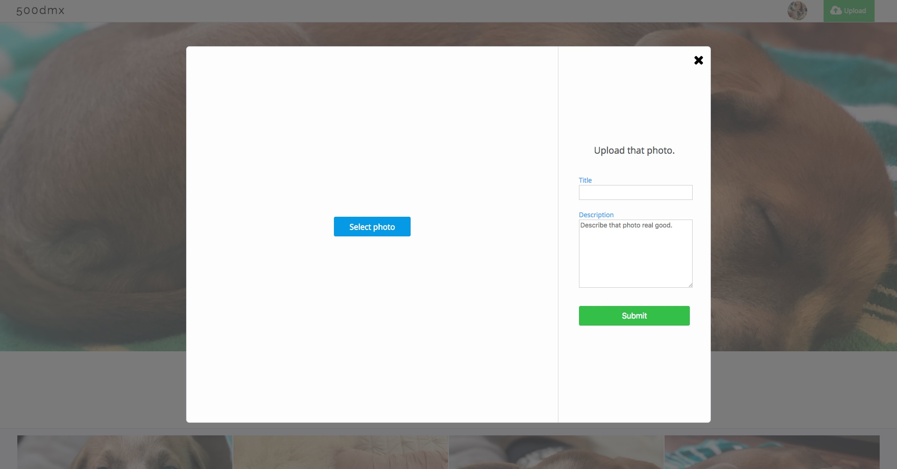

# 500dmx

[live site](https://fivehundreddmx.herokuapp.com)

500dmx is a full-stack single-page app (SPA) inspired by photo sharing sites like 500px. It uses a React/Redux front end and a Ruby on Rails backend to serve up a RESTful json API.

## Features
- User authentication with demo login
- User photo uploads
- Amazon AWS S3 storage
- Follow users and feed page
- Mobile first responsive CSS

### User authentication and Demo Login
Users can try out the site first using the demo login feature.

### Mobile Responsiveness
500dmx uses mobile first CSS to deliver a seamless experience between computer and mobile screens with a combination of Flexbox and the new CSS Grid system.

### User uploads
Users can upload their beautiful photos using the upload modal that is available on every page as well as delete and edit photos on the manage page.

### Photo feed
A photo feed is available to users for keeping up to date with new photos uploaded by the users followers.

